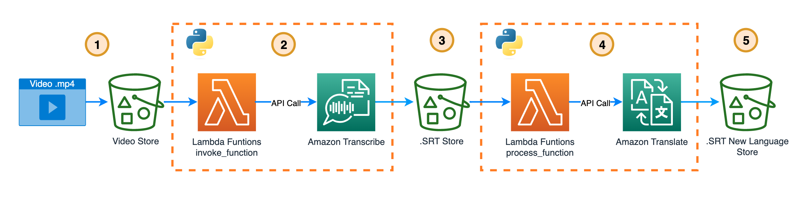
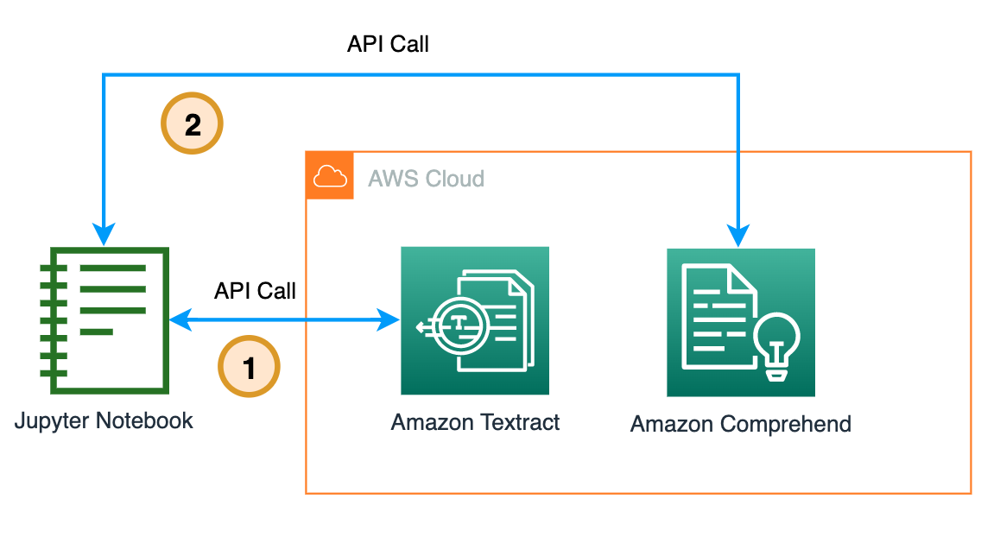
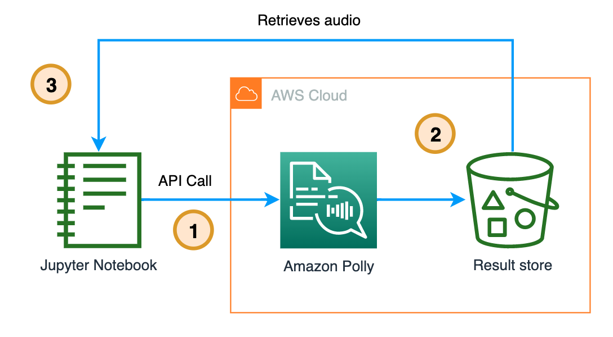
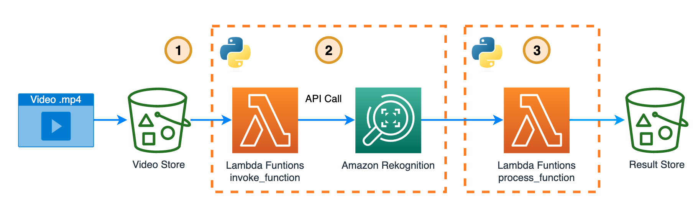

## AIML like api in your app from [All the things that comprehend rekognition textract polly transcribe and others do](https://github.com/build-on-aws/all-the-things-that-comprehend-rekognition-textract-polly-transcribe-and-others-do)

Here you can find the steps to create the following solutions:

- [Create subtitles and translate them into the language you want ⏯️ 🍿.](create-subtitles-and-translate-them-into-the-language-you-want/README.md)

- [Detecting entities and sentiment from a document 🔎 📄. ](detecting-entities-and-sentiment-from-a-document/detecting-entities-and-sentiment-from-a-document.ipynb)

- [Make Polly Talk 🦜](make-polly-talk/make-polly-talk.ipynb) 

- [Video content moderation ⏯️ 🔫 🚬]((video-content-moderation/README.md) )

## Security

See [CONTRIBUTING](CONTRIBUTING.md#security-issue-notifications) for more information.

## License

This library is licensed under the MIT-0 License. See the LICENSE file.

