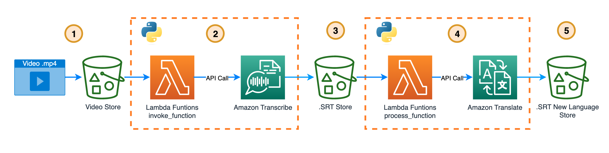

# Create subtitles and translate them into the language you want ⏯️ 🍿.

---

 and has the following steps:

This solution is created with [AWS Cloud Development Kit (AWS CDK)](https://docs.aws.amazon.com/cdk/v2/guide/home.html)

## 1. Upload the .mp4 video to an [Amazon s3 bucket](https://docs.aws.amazon.com/es_es/AmazonS3/latest/userguide/UsingBucket.html).

You can find the video at [moderation-video.mp4](moderation-video.mp4), and load it in the Amazon s3 Bucket that will create the CDK stack. 

## 2. A [Lambda Function](https://docs.aws.amazon.com/lambda/latest/dg/welcome.html) makes the call to Transcribe API.

Lambda Funtions that executes this call is [lambda_invokes_transcribe/lambda_function.py](build-cdk/lambda_invokes_transcribe/lambda_function.py)


## Using the api call Start Transcription job: 

Transcribes the audio from a media file and applies any additional Request Parameters you choose to include in your request.

To make a StartTranscriptionJob request, you must first upload your media file into an Amazon S3 bucket; you can then specify the Amazon S3 location of the file using the Media parameter. 

The below process should take ~1 minute to complete... depends on the size of the video.

[Documentation](https://boto3.amazonaws.com/v1/documentation/api/latest/reference/services/transcribe/client/start_transcription_job.html)

```python
transcribe_client  = boto3.client('transcribe')

response = transcribe_client.start_transcription_job(
                TranscriptionJobName=jobName,
                LanguageCode= SOURCE_LANG_CODE,
                MediaFormat='mp4',
                Media={
                'MediaFileUri': s3Path
                },
                OutputBucketName = s3bucket,
                OutputKey=OutputKey.replace(".mp4",""), 
                Subtitles={
                'Formats': [
                    'srt'
                ]}
                )

            TranscriptionJobName = response['TranscriptionJob']['TranscriptionJobName']
        
print("Processing....")
print("TranscriptionJobName : {}".format(TranscriptionJobName))
```

## 3. Subtitles file in the original language are downloaded to S3 Bucket. 


When the TranscriptionJobName ends Transcibes saves the file in the bucket OutputBucketName


## 4. A Lambda Function makes the call to Translate API.

Lambda Funtions that executes this call is [lambda_invokes_translate/lambda_function.py](build-cdk/lambda_invokes_translate/lambda_function.py)

## Using the api call [Translate Text](https://boto3.amazonaws.com/v1/documentation/api/latest/reference/services/translate/client/translate_text.html): 

Translates input text from the source language to the target language. For a list of available languages and language codes, see [Supported languages](https://docs.aws.amazon.com/translate/latest/dg/what-is-languages.html).

```python
translate_client = boto3.client('translate')

translate = translate_client.translate_text(
            Text=text, 
            SourceLanguageCode=sourceLanguage,
            TargetLanguageCode=targetLanguage)
            
result = translate['TranslatedText']

```

## 5. Subtitles file in the new language is downloaded to S3 Bucket. 

Download the new subtitles using [Upload Fileobj](https://boto3.amazonaws.com/v1/documentation/api/latest/reference/services/s3/client/upload_fileobj.html) from [S3 Client](https://boto3.amazonaws.com/v1/documentation/api/latest/reference/services/s3.html) API Call :

```python
client_s3 = boto3.client('s3')

def put_file(base_path,filename, bucket, key):
    with open(base_path+filename, "rb") as data:
        client_s3.upload_fileobj(data,bucket, key+filename)
    print("Put file in s3://{}{}{}".format(bucket,key,filename))
```

## 🚀 Built the app.

Before built  set the following parameters in [build_cdk_stack.py](build-cdk/build_cdk/build_cdk_stack.py)

[Language code](https://docs.aws.amazon.com/translate/latest/dg/what-is-languages.html)

```
REGION_NAME = 'YOUR-REGION'
SOURCE_LANG_CODE = 'SOURCE_LANG_CODE'
TARGET_LANG_CODE = 'TARGET_LANG_CODE'
```

To build follow the steps [here](build-cdk/README.md)

You can learn more about Amazon Translate [Code Samples](https://github.com/aws-samples/document-translation).. [more code samples](https://docs.aws.amazon.com/translate/latest/dg/examples.html)


