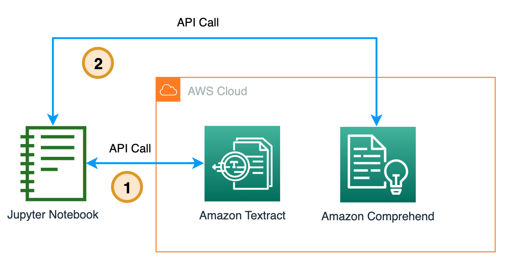

# Detecting entities and sentiment from a document 🔎 📄.



Find the code here --> [make-polly-talk.ipynb](detecting-entities-and-sentiment-from-a-document.ipynb)

## 1 . From a Jupyter Notebook make the call to Amazon Textract API.

Using [Detect Document Text API](https://boto3.amazonaws.com/v1/documentation/api/latest/reference/services/textract/client/detect_document_text.html)

```python
# Amazon Textract client
textract_client = boto3.client('textract')

response = textract_client.detect_document_text(
        Document={
            'Bytes': document.read(),
        }
    )
```

## 2. With the response from Textract, make the call to Comprehend API. 

Using [Detect Sentiment API](https://boto3.amazonaws.com/v1/documentation/api/latest/reference/services/comprehend/client/detect_sentiment.html)

```python
# Amazon Comprehend client
comprehend_client = boto3.client('comprehend')

sentiment =  comprehend_client.detect_sentiment(LanguageCode="en", Text=text)

print ("\nSentiment\n========\n{}".format(sentiment.get('Sentiment')))

```

Now with [Detect entities API](https://boto3.amazonaws.com/v1/documentation/api/latest/reference/services/comprehend/client/detect_entities.html)

```python
comprehend_client = boto3.client('comprehend')

entities =  comprehend_client.detect_entities(LanguageCode="en", Text=text)

print("\nEntities\n========")

for entity in entities["Entities"]:
    print ("{}\t=>\t{}".format(entity["Type"], entity["Text"]))

```

You can learn more about Amazon Transcribe and Amazon Comprehend with this [Code Samples](https://github.com/aws-samples/amazon-transcribe-comprehend-podcast)
