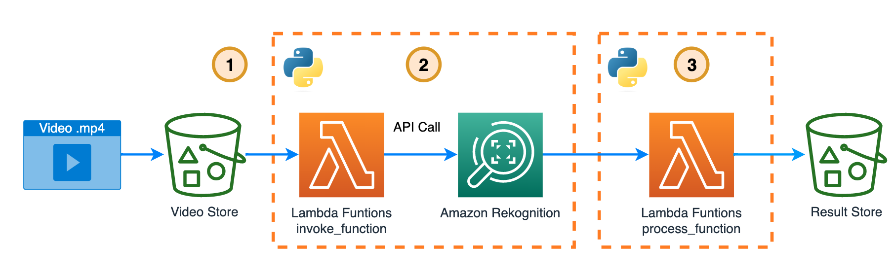

# Video content moderation



This solution is created with [AWS Cloud Development Kit (AWS CDK)](https://docs.aws.amazon.com/cdk/v2/guide/home.html)

## 1. Upload the .mp4 video to an [s3 bucket](https://docs.aws.amazon.com/es_es/AmazonS3/latest/userguide/UsingBucket.html).

You can find the video at [moderation-video.mp4](moderation-video.mp4), and load it in the Amazon s3 Bucket that will create the CDK stack. 

## 2. A Lambda Function makes the call to Rekognition API.

Call Rekognition [StartContentModeration API](https://docs.aws.amazon.com/cli/latest/reference/rekognition/start-content-moderation.html) to detect inappropriate information in the video. StartContentModeration returns a job identifier (JobId ) which you use to get the results of the analysis. When content moderation analysis is finished, Amazon Rekognition Video publishes a completion status to the [Amazon Simple Notification Service topic](https://docs.aws.amazon.com/sns/latest/dg/welcome.html) that you specify in NotificationChannel.

The below process should take ~1 minute to complete... depends on the size of the video.

Lambda Funtions that executes this call is [lambda_invokes_transcribe/lambda_function.py](build-cdk/lambda_invokes_rekognition/lambda_function.py)

Check [boto3 document](https://boto3.amazonaws.com/v1/documentation/api/1.9.42/reference/services/rekognition.html#Rekognition.Client.start_content_moderation) for details. 

```python
rekognition_client = boto3.client('rekognition')
startModerationLabelDetection = rekognition.start_content_moderation(
            Video={'S3Object': {
                     'Bucket': bucket1, 
                       'Name': filename, }
                },
            NotificationChannel= {
            'SNSTopicArn': SNS_REKOGNITION,
            'RoleArn'    : SNS_ROLE_ARN_REKOGNITION
                                })

        moderationJobId = startModerationLabelDetection['JobId']
print("Job Id: {0}".format(moderationJobId))
```

## 3. Once the video review is finished, a new Lambda Function retrieves the result and stores it in an s3 bucket.

In this step you have to Call Rekognition [GetContentModeration API](https://docs.aws.amazon.com/rekognition/latest/APIReference/API_GetContentModeration.html) Content moderation analysis of a video is an asynchronous operation. You start analysis by calling . which returns a job identifier (JobId ). When analysis finishes, Amazon Rekognition Video publishes a completion status to the Amazon Simple Notification Service topic registered in the initial call to StartContentModeration . To get the results of the content moderation analysis, first check that the status value published to the Amazon SNS topic is SUCCEEDED . 

Check [boto3 document](https://boto3.amazonaws.com/v1/documentation/api/1.9.42/reference/services/rekognition.html#Rekognition.Client.get_content_moderation) for details.

Lambda Funtions that executes this call is [lambda_invokes_transcribe/lambda_function.py](build-cdk/lambda_process_rekognition/lambda_function.py)

```python
getContentModeration = rekognition_client.get_content_moderation(
            JobId=moderationJobId,
            SortBy='TIMESTAMP')
print(getContentModeration['JobStatus'])
```

## 🚀 Built the app.

To build follow the steps [here](build-cdk/README.md)

You can learnd more about Amazon Rekognition with this [Code Samples](https://github.com/aws-samples/amazon-rekognition-code-samples)